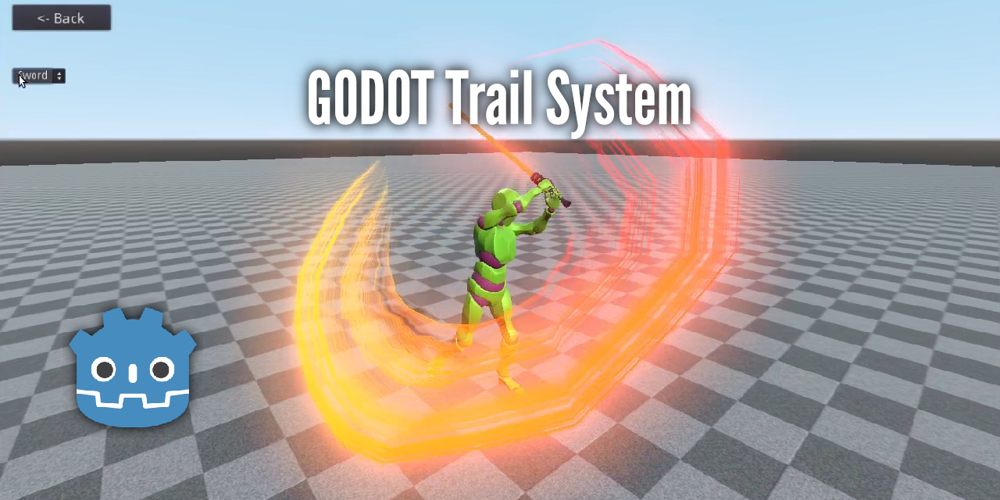

# Godot Trail System
Advanced 2D/3D Trail system.

[](https://github.com/OBKF/Godot-Trail-System/issues) [](https://github.com/OBKF/Godot-Trail-System/network) [](https://github.com/OBKF/Godot-Trail-System/stargazers) [](https://github.com/OBKF/Godot-Trail-System/blob/master/LICENSE) [](https://twitter.com/intent/tweet?text=Wow:&url=https%3A%2F%2Fgithub.com%2FOBKF%2FGodot-Trail-System)



If you like this plugin and want to thank me with a small donation feel free to do this here:

[](https://www.paypal.com/cgi-bin/webscr?cmd=_s-xclick&hosted_button_id=KWUGZUUBASZY4)

## Description
Godot Trail System is an advanced trail/ribbon plugin for the Godot Engine similar to Unity3D's system. The plugin offers full features in 3D and basic 2D functionality (it will be updated later). 

### Features
- Variable width using Curve.
- Variable color using Gradient.
- Stretched and Tiled texture.
- Align to the view so it gives volume effect.
- Chaikin’s smoothing Algorithm [PDF](https://www.cs.unc.edu/~dm/UNC/COMP258/LECTURES/Chaikins-Algorithm.pdf).
- Customizable via script.
- Open-Source under MIT license.

### Editor Parameters (3D)
- **Emit**: Whether the system process or not, it must be disabled when using script functions.
- **Distance**: The distance between each point of the trail.
- **Segments**: The number of points that make up the path.
- **Lifetime**: Time in seconds before the point gets deleted.
- **Base Width**: The width of the trail if the ___"Width Profile"___ is not set up.
- **Tiled Texture**: Tile the UVs for the textures used in the material, it is calculated automatically if ___"Tilling"___ is set to.
- **Tiling**: Tile the UVs for the textures used in the material by a fixed number of times.
- **Width Profile**: Change the width of the trail according to the curve relative to the ___"Base Width"___.
- **Color Gradient**: Change the color of the trail according to the gradient, ___Material>Vertex Color>Use As Albedo___ must be enabled for this function to work.
- **Smooth Iterations**: Choose how much smoothing you want for the trail (3 levels), This is helpful if ___"Distance"___ is set to a large number.
- **Smoothing Ratio**: Smoothing factor for Chaikin's smoothing algorithm.
- **Alignment**: The method used to calculate the width normal of the trail:
    - View (default): Makes the trail look 3D by aligning the geometry to face the camera.
    - Normal: The points width orientation follow the parent object's orientation when the point was emitted (Sword Slash).
    - Object: Makes all points of the trail width orientation follow the parent object's orientation (Tron like trail).
- **Axe**: The axes used to calculate the Alignment (doesn't work for ___"View"___ since it follows the camera).
- **Show Wireframe**: Show a wireframe overlay over the trail for debug purposes.
- **Wireframe Color**: The color of the wireframe.
- **Wire Line Width**: The width of the wireframe (currently not working).

\*Similar parameters for 2D.\*

### Using Script
You can use the trail from script to create Vehicle skid marks, Path (see 3D Navigation Mesh demo) and many more.

Example from [3D Navigation Mesh demo](navmesh.gd)
```gdscript
    extends Navigation

    def draw_path():
        var src_points = get_simple_path(begin, end, true)
        get_node("trail").clear_points()
        for i in range(src_points.size()):
            var normal = get_closest_point_normal(src_points[i]).normalized()
            var offset = normal*0.1
            var _transform = Transform(Basis(normal), src_points[i]+offset)
            get_node("trail").add_point(_transform)
        get_node("trail").smooth()
        get_node("trail").render(true)
```

### Showcase (Youtube)
[](https://youtu.be/cqkCt9XIBA0)

### Contact
- [Twitter](https://twitter.com/OBKF_/)

